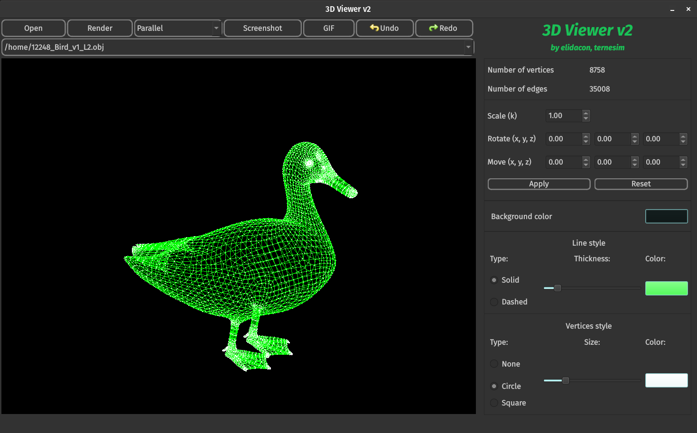

# 3DViewer v2.0 (Group project, 2 members)

## My part of the project
My part was to:
   + Migrate the code from C to C++
   + Adapt the code to the MVC pattern
   + Implement Singleton and Observer patterns
   + Add tests

So for my code you can basically check all files, except [command](src/view/command/) folder

## Score:
The final score is 140% (max).

The 3DViewer v2.0 was developed with frontend with QT 6.5.2. For more details see [documentation](src/doc_3DViewer_v2.pdf).

## Task

Implementation of a program to view 3D wireframe models (3D Viewer) in the C++ programming language using MVC pattern and at least three different design patterns. The models themselves are loaded from .obj files and are viewable on the screen with the ability to rotate, scale and translate.

## Requirements

- The program must be built with Makefile which contains standard set of targets for GNU-programs: all, install, uninstall, clean, dvi, dist, tests. Installation directory could be arbitrary, except the building one
- The program should be developed according to the principles of object-oriented programming; the structured programming approach is not allowed
- Prepare full coverage of modules related to model loading and affine transformations with unit-tests
- There should be only one model on the screen at a time
- The program must provide the ability to:
    - Load a wireframe model from an obj file (vertices and surfaces list support only).
    - Translate the model by a given distance in relation to the X, Y, Z axes.
    - Rotate the model by a given angle in relation to its X, Y, Z axes.
    - Scale the model by a given value.
- The graphical user interface must contain:
    - A button to select the model file and a field to output its name.
    - A visualisation area for the wireframe model.
    - Button/buttons and input fields for translating the model.
    - Button/buttons and input fields for rotating the model.
    - Button/buttons and input fields for scaling the model.
    - Information about the uploaded model - file name, number of vertices and edges.
- The program must correctly processes and allows user to view models with details up to 100, 1000, 10,000, 100,000, 1,000,000  vertices without freezing (a freeze is an interface inactivity of more than 0.5 seconds)
- The program must be implemented using the MVC pattern, and also:
    - there should be no business code in the view code
    - there should be no interface code in the controller and the model
    - controllers must be thin
- There should be at least three different design patterns (e.g. facade, strategy and command)

## Part 2. Bonus. Settings

- The program must allow customizing the type of projection (parallel and central)
- The program must allow setting up the type (solid, dashed), color and thickness of the edges, display method (none, circle, square), color and size of the vertices
- The program must allow choosing the background color
- Settings must be saved between program restarts

## Part 3. Bonus. Record

- The program must allow saving the captured (rendered) images as bmp and jpeg files.
- The program must allow recording small screencasts - the current custom affine transformation of the loaded object into gif-animation (640x480, 10fps, 5s) by a special button
